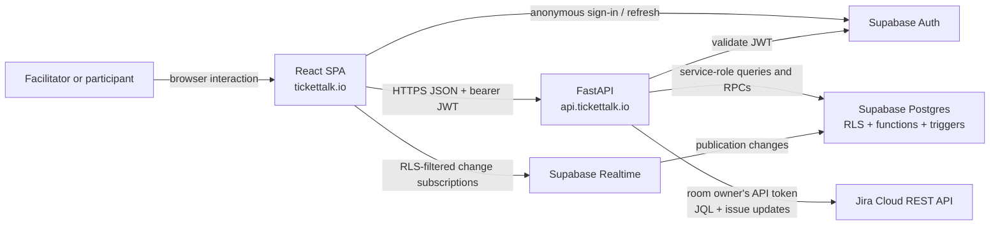
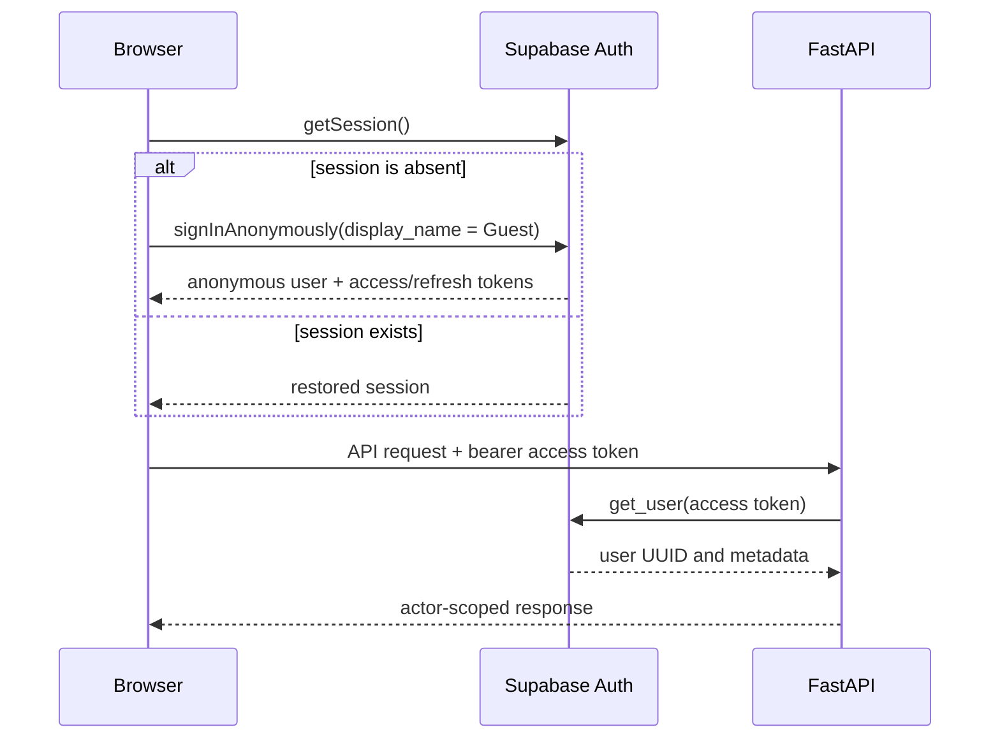
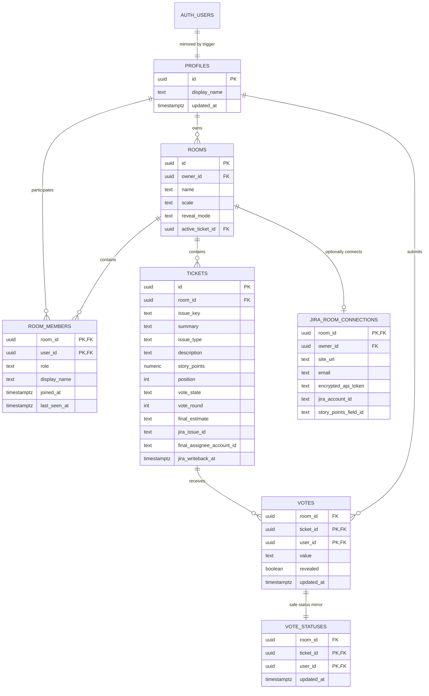
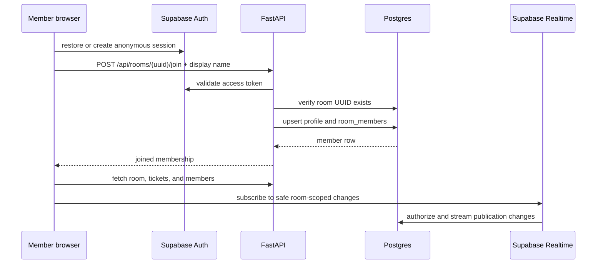
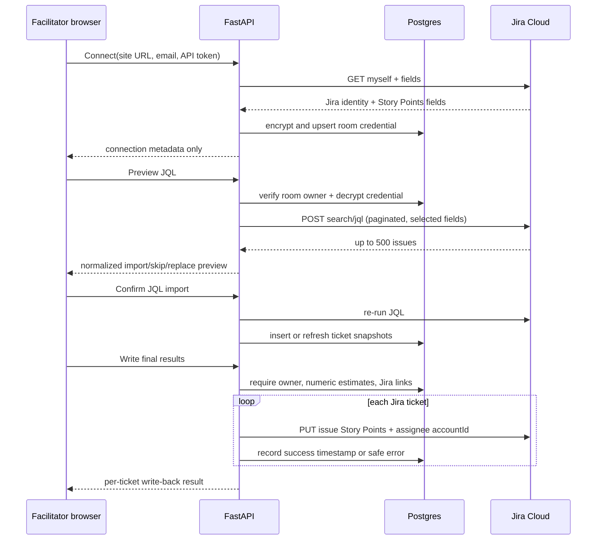
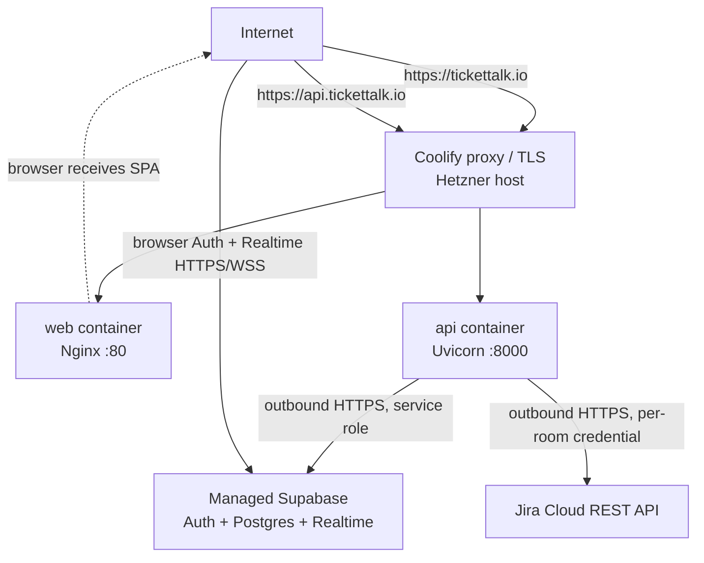

# tickettalk architecture

This document describes the current product architecture and data flows implemented in this repository. It is the reference for changes that cross the React client, FastAPI, Supabase, or production deployment.

## Product model

tickettalk is a registration-free planning-poker application. A facilitator creates a private room, imports or adds tickets, selects the active ticket, collects hidden estimates, reveals the votes, records a final estimate, and exports or writes back the completed pricing summary. Participants join from the room's UUID URL and receive live session updates.

The main product invariants are:

- There is no email/password registration flow. Every browser receives a persistent anonymous Supabase identity.
- The unguessable room UUID is a capability link: knowing it grants the ability to request membership, but room reads and mutations still require a valid browser identity and room membership.
- One browser identity owns the room and is its facilitator. Other identities are members.
- Only the active ticket accepts votes.
- Raw vote values remain private until the ticket is revealed.
- Only the facilitator can manage the backlog, select tickets, reveal votes, set final estimates, export, or delete a room.
- Clearing browser storage creates a new anonymous identity. The new identity does not inherit the old identity's memberships or facilitator ownership.

## System context



The browser has two Supabase-facing responsibilities: anonymous authentication and Realtime subscriptions. Business reads and writes use FastAPI. The Supabase service-role key exists only in the API container and must never be built into the frontend.

## Runtime components

| Component | Responsibility | State and trust boundary |
| --- | --- | --- |
| React + Vite SPA | Routing, room UI, voting UI, session persistence, API calls, Realtime invalidation | Runs in an untrusted browser. Contains only the public Supabase URL and publishable anon key. |
| Nginx web container | Serves immutable SPA assets, returns `index.html` for client routes, exposes `/healthz` | Stateless. |
| FastAPI | Validates JWTs, normalizes inputs, applies product authorization, rate-limits sensitive endpoints, orchestrates repository operations, creates CSV exports | Public API boundary. Holds the Supabase service-role key and Jira credential-encryption key. |
| Jira adapter | Validates room-scoped Jira credentials, paginates JQL results, converts ADF descriptions, discovers Story Points fields, lists assignable users, and writes final issue fields | Server-side outbound boundary. Decrypted API tokens exist only for the duration of a Jira request. |
| Repository layer | Maps product operations to Supabase queries/RPCs; provides an in-memory implementation for local development and unit tests | The production implementation uses a service-role client, so it must enforce actor and room scope before data access. |
| Supabase Auth | Creates and refreshes anonymous identities and validates browser access tokens | `auth.users` is the identity source of truth. |
| Supabase Postgres | Stores rooms, memberships, tickets, votes, presence, and safe vote status; runs RLS, triggers, views, and transactional functions | Durable source of truth. |
| Supabase Realtime | Publishes safe room-scoped changes to connected members | Raw `votes` are excluded from the publication; `vote_statuses` carries only the fact that someone voted. |
| Coolify on Hetzner | Builds and runs the web and API containers, terminates TLS, routes public domains | Application hosting boundary. Supabase remains externally managed. |

## Identity and authorization

### Anonymous browser identity

On application startup, the frontend calls `supabase.auth.getSession()`. If no session exists, it calls `signInAnonymously()` and Supabase creates an `auth.users` row plus access and refresh tokens. Supabase JS stores and refreshes the session in browser storage.

The user-supplied display name is stored in Auth metadata and mirrored into `public.profiles`. It is presentation data; authorization always uses the immutable user UUID from the JWT `sub` claim.

Every API request retrieves the current access token and sends:

```http
Authorization: Bearer <supabase-access-token>
```

FastAPI asks Supabase Auth for the user represented by the token and creates a `Principal`. Missing, expired, deleted, or cross-project identities are rejected with `401`.



### Room capability and membership

Room URLs use `/rooms/<uuid>`. The UUID is the discovery secret, not a replacement for authentication:

1. A browser must have a valid anonymous identity.
2. Knowing a real room UUID allows that identity to call the join endpoint.
3. Joining creates or refreshes a `room_members` row.
4. Later reads require the actor to be the owner or a member.
5. Facilitator-only operations additionally require `rooms.owner_id == principal.id`.

The API returns only rooms owned by the current browser on the home screen. Joined rooms remain accessible from their capability URLs but are not listed as owned rooms.

| Operation | Facilitator | Member | Authenticated outsider with UUID |
| --- | :---: | :---: | :---: |
| Join room | Yes | Yes | Yes |
| Read joined room, tickets, members | Yes | Yes | No, until joined |
| Submit/change vote on active unrevealed ticket | Yes | Yes | No |
| Change room settings or backlog | Yes | No | No |
| Select active ticket, reveal, re-vote, set final estimate | Yes | No | No |
| Export or delete room | Yes | No | No |
| Connect Jira, run JQL, choose final assignees, write back | Yes | No | No |

### Defense in depth

The production repository uses the service-role key and therefore bypasses RLS. FastAPI and the repository must enforce actor, membership, ownership, room, and ticket scope before each privileged query.

RLS remains important because the browser connects directly to Supabase for Realtime and because it limits authenticated direct database access. Database constraints and triggers independently enforce active-ticket voting, valid scales, vote privacy, and ticket/room relationships.

CORS permits the configured frontend origin, but CORS is not an authorization control. JWT validation and actor-scoped repository checks are always required.

## Data model



Additional derived state:

- `room_rollups` is a security-invoker view that adds `ticket_count`, `sized_count`, and numeric `total_points` to rooms.
- `rooms.active_ticket_id` synchronizes the shared session. `null` means no ticket is active; before a session this means not started, and after all tickets are priced the frontend interprets it as voting closed.
- `tickets.vote_state` is `voting` or `revealed`; `vote_round` increments after a re-vote.
- T-shirt estimates are intentionally excluded from the numeric `total_points` sum.
- Deleting a room cascades through membership, tickets, votes, and vote statuses.

## Core data flows

### Create a room

1. The facilitator chooses a display name, room name, scale, and reveal mode.
2. The browser updates its anonymous Auth metadata and posts the room configuration to FastAPI.
3. FastAPI validates the bearer token and input.
4. The repository calls `create_room_with_facilitator`.
5. The database function upserts the profile, inserts the room, and inserts the facilitator membership in one transaction.
6. The API returns the room UUID and the SPA navigates to `/rooms/<uuid>`.

### Join a shared room



Joining is idempotent for the same browser identity: it refreshes the display name and `last_seen_at` rather than creating a duplicate member.

### Presence and synchronization

The browser posts a presence heartbeat every 15 seconds. A member is considered online when `last_seen_at` is no more than 45 seconds old. Presence is best-effort session state, not an audit trail.

The browser subscribes to changes for the current room in:

- `rooms`
- `room_members`
- `tickets`
- `vote_statuses`

Realtime messages are invalidation signals. When one arrives, the client refetches the room, ticket list, and member list from FastAPI. This keeps authorization and response shaping at the API boundary and prevents the UI from depending on partial or stale event payloads.

`votes` is deliberately removed from the Realtime publication. A trigger mirrors vote identity and timestamp into `vote_statuses`, allowing the UI to show who has voted without publishing vote values.

### Ticket import and backlog management

1. The facilitator pastes CSV/TSV or selects a file. The client limits files to 1 MB.
2. FastAPI parses headers and rows, normalizes Jira keys, validates required values, and limits the input to 500 tickets.
3. The preview classifies rows as import, skip, or replace and reports row-level fixes.
4. Saving reparses and revalidates the payload to avoid trusting the browser preview.
5. The repository inserts new tickets or updates selected duplicates, then returns the ordered backlog.

Jira issue keys are unique per room when present. Manual tickets may omit an issue key. Reordering uses the database function `reorder_room_tickets`, which requires every room ticket exactly once and updates positions atomically.

Import persistence currently performs row operations sequentially rather than in one database transaction. A mid-import infrastructure failure can therefore leave an incomplete batch; retry behavior must respect issue-key duplicate handling.

### Jira JQL import and write-back

Jira access is optional and scoped to one room. Only the facilitator can submit or use a credential. FastAPI validates the supplied Jira Cloud URL, authenticates with the email and API token, discovers candidate Story Points fields, encrypts the token with `JIRA_ENCRYPTION_KEY`, and stores only ciphertext in `jira_room_connections`. The table grants no access to `anon` or `authenticated`; only the API service role can read it after checking room ownership.



JQL saving deliberately re-runs the query instead of trusting browser preview rows. Imported tickets store Jira's immutable issue ID, mutable issue key, source estimate, source assignee, and source update timestamp. The existing duplicate policy remains keyed by the normalized issue key. Replacing a snapshot does not directly change vote rows or final estimates.

The current write-back is synchronous and sequential. It is explicit rather than automatic: the summary lets the facilitator revise final estimates, choose a final assignable Jira user, then confirm one batch. The ownership chart is derived client-side from `tickets.final_assignee_display_name`; Jira-linked tickets are grouped by final Jira assignee, while manual tickets and Jira tickets without an owner are grouped as `Unassigned`. Each issue update sends the numeric final estimate to the discovered Story Points field and the final assignee as a Jira `accountId`. Failures are isolated and returned per ticket. T-shirt rooms cannot write to numeric Story Points and remain export-only.

### Voting, reveal, and final estimate

```mermaid
sequenceDiagram
    participant F as Facilitator browser
    participant M as Member browser
    participant API as FastAPI
    participant DB as Postgres
    participant RT as Realtime

    F->>API: PATCH active-ticket
    API->>DB: set rooms.active_ticket_id
    DB-->>RT: room update
    RT-->>M: room invalidated
    M->>API: refetch active room state

    M->>API: PUT vote(value)
    API->>DB: validate membership, active ticket, scale; upsert vote
    DB->>DB: guard open round + sync vote_status
    DB-->>RT: safe vote_status change
    RT-->>F: vote status invalidated
    F->>API: refetch member vote statuses

    alt manual reveal
        F->>API: POST reveal
        API->>DB: reveal_ticket_votes RPC
    else automatic reveal
        DB->>DB: reveal when all recently active members voted
    end
    DB-->>RT: ticket update
    RT-->>F: ticket invalidated
    RT-->>M: ticket invalidated
    F->>API: GET revealed results
    M->>API: GET revealed results
    API-->>F: values + average/range/consensus
    API-->>M: values + average/range/consensus

    F->>API: PUT final-estimate
    API->>DB: validate revealed state and room scale; save estimate
```

Vote safeguards operate at both API and database levels:

- The actor must already be a room member.
- The ticket must be the room's active ticket.
- The ticket must still be in `voting` state.
- The value must belong to the room's configured scale.
- A member can upsert one vote per ticket and cannot change it after reveal.
- Before reveal, API vote submission returns only a receipt, never the submitted value.
- Vote results include values only when `tickets.vote_state == 'revealed'`.

In automatic mode, the database serializes the reveal decision by locking the room row and comparing votes with members active in the last 45 seconds. Manual reveal and re-vote use database functions so round transitions are atomic.

Re-vote deletes the ticket's votes, clears the final estimate, changes the ticket back to `voting`, increments `vote_round`, and preserves the ticket as active.

After the last outstanding final estimate is saved, the facilitator closes voting by setting `active_ticket_id` to `null`. Realtime moves connected participants to the summary. There is currently no separate `closed_at` or room-status column; completion is derived from `active_ticket_id == null` plus every ticket having a final estimate.

### Summary, export, and deletion

- Room completion is `tickets with final_estimate / all tickets`.
- Completed rooms with no active ticket open directly on the summary.
- The summary presents ticket counts, numeric point totals, and percentage share by final Jira assignee; unassigned and manual tickets are kept visible.
- The facilitator can update any revealed ticket's final estimate using the room scale. Jira-linked tickets can also be reassigned to users returned by Jira's assignable-user API. These edits use the existing protected ticket endpoints and immediately update the summary distribution.
- Participants can see the final ownership and prices but cannot edit them.
- Export is generated server-side as CSV and is facilitator-only.
- Deletion is facilitator-only, requires an exact room-name confirmation in the UI, and cascades through room-owned data.
- The API logs the room and owner UUID for deletion. General request logs include the request path, which can contain a room UUID, but exclude bodies, tokens, and vote values. Logs must therefore be treated as capability-sensitive operational data.

## Deployment architecture



The Compose project does not publish host ports. Coolify routes each public hostname to the exposed container port on the private `app` network.

Production configuration is split by trust level:

| Variable | Location | Sensitivity |
| --- | --- | --- |
| `VITE_API_URL` | Frontend build | Public |
| `VITE_SUPABASE_URL` | Frontend build | Public |
| `VITE_SUPABASE_ANON_KEY` | Frontend build | Public publishable key |
| `FRONTEND_ORIGIN` | API runtime | Configuration |
| `SUPABASE_URL` | API runtime | Configuration |
| `SUPABASE_SERVICE_ROLE_KEY` | API runtime only | Secret |
| `JIRA_ENCRYPTION_KEY` | API runtime only | Secret; encrypts room Jira tokens |
| `RATE_LIMIT_*_PER_MINUTE` | API runtime | Configuration |

`/health` proves the API process is alive. `/health/ready` also checks the repository/Supabase dependency. Nginx exposes `/healthz` for the web container.

## Observability and abuse controls

- Every API response receives an `X-Request-ID`; a valid caller-supplied request ID is preserved.
- HTTP logs contain method, path, status, duration, and request ID, without bodies or credentials.
- Join, import, and vote endpoints have configurable per-minute limits.
- Rate limiting is in API process memory. It is suitable for the current single API replica but is not globally consistent across multiple replicas or restarts.
- CORS is restricted to `FRONTEND_ORIGIN`.

Operational procedures, rollback, backups, and secret rotation are documented in [`docs/deployment.md`](docs/deployment.md) and [`docs/operations.md`](docs/operations.md).

## Development and verification

When Supabase credentials are absent in development, the frontend uses a fixed development token and FastAPI selects `InMemoryRepository`. This makes local UI and unit testing fast but does not exercise production RLS, Auth, triggers, or Realtime behavior.

CI covers four boundaries:

1. Backend Ruff and pytest.
2. Frontend ESLint, coverage tests, and Vite build.
3. Local Supabase migrations, pgTAP RLS tests, and the two-client integration flow.
4. Production Docker Compose configuration and container builds.

Database schema changes must be additive migrations in `supabase/migrations`. Do not edit migration history after it has been applied remotely; add a correcting migration instead.

## Source map

| Concern | Primary source |
| --- | --- |
| Frontend application and session state | `frontend/src/App.jsx` |
| Jira connection/import/write-back UI | `frontend/src/components/JiraPanels.jsx` |
| Derived room navigation and completion state | `frontend/src/lib/workspace.js` |
| Browser authentication | `frontend/src/lib/auth.js` |
| API client | `frontend/src/lib/api.js` |
| Realtime subscriptions | `frontend/src/lib/supabase.js` |
| FastAPI app factory, core routes, and CSV export | `backend/app/main.py` |
| Shared FastAPI dependencies | `backend/app/dependencies.py` |
| Jira API routes and orchestration | `backend/app/jira_routes.py` |
| JWT validation and principals | `backend/app/auth.py` |
| Product models and validation | `backend/app/models.py` |
| Production and in-memory repositories | `backend/app/repositories.py` |
| Jira import parsing | `backend/app/jira.py` |
| Jira REST client and token encryption | `backend/app/jira_client.py` |
| Request IDs, logging, and rate limits | `backend/app/observability.py` |
| Database schema, functions, triggers, and RLS | `supabase/migrations/` |
| RLS regression tests | `supabase/tests/rls.sql` |
| Runtime topology | `compose.yaml` |
| CI gates | `.github/workflows/ci.yml` |

## Known architectural constraints

- Anonymous identity recovery is browser-storage based. There is no account recovery or facilitator transfer flow.
- Capability URLs should be treated as private. Anyone who obtains a valid UUID can request membership.
- Room UUIDs appear in API paths and can therefore appear in proxy and application access logs; log access and retention must respect their capability-like sensitivity.
- Completion/closure is derived rather than modeled as an explicit room state.
- Import persistence is not atomic across the entire batch.
- Jira JQL import and write-back run synchronously and sequentially. Large rooms may need durable background jobs in a later release.
- Jira credentials are room-scoped but bound to the facilitator's browser identity. Losing that anonymous identity removes access to manage or disconnect the connection.
- Rotating `JIRA_ENCRYPTION_KEY` without a dual-key migration requires reconnecting every Jira-enabled room.
- Presence and automatic-reveal eligibility use a fixed 45-second activity window.
- In-memory rate limits do not coordinate across horizontally scaled API replicas.
- The API's service-role database access makes repository authorization review a critical security requirement.
